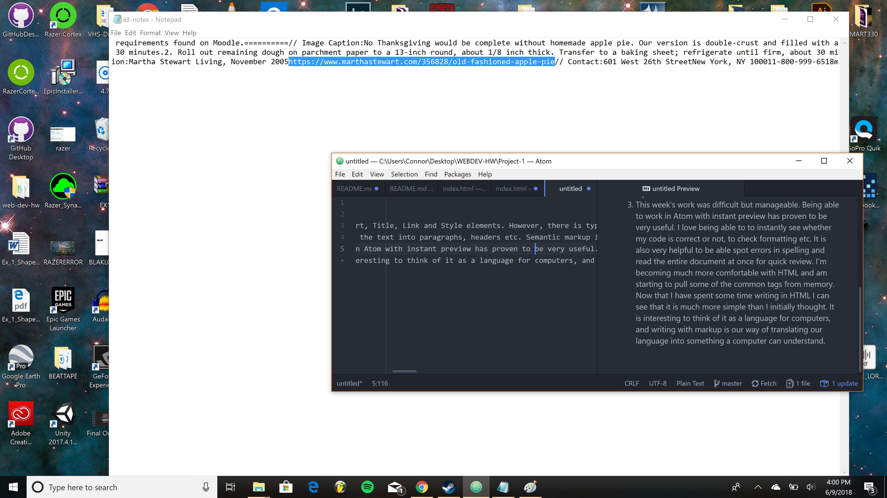

<h1>THIS IS A README</h1>
<ol>
  <li>The head usually contains five elements. These are the Meta, Viewport, Title, Link and Style elements. However, there is typically only 1 head element within a page. There also is usually only one body element on a page.
  <li>Structural markup contains information about a document that breaks the text into paragraphs, headers etc. Semantic markup is used for more subtle changes to the text of the document-usually bold or italics to emphasize a particular word.
  <li>This week's work was difficult but manageable. Being able to work in Atom with instant preview has proven to be very useful. I love being able to to instantly see whether my code is correct or not, to check formatting etc. It is also very helpful to be able spot errors in spelling and read the entire document at once for quick review. I'm becoming much more comfortable with HTML and am starting to pull some of the common tags from memory. Now that I have spent some time writing in HTML I can see that it is much more simple than I initially thought. It is interesting to think of it as a language for computers, and writing with markup is our way of translating our language into something a computer can understand.
  </ol>
 
