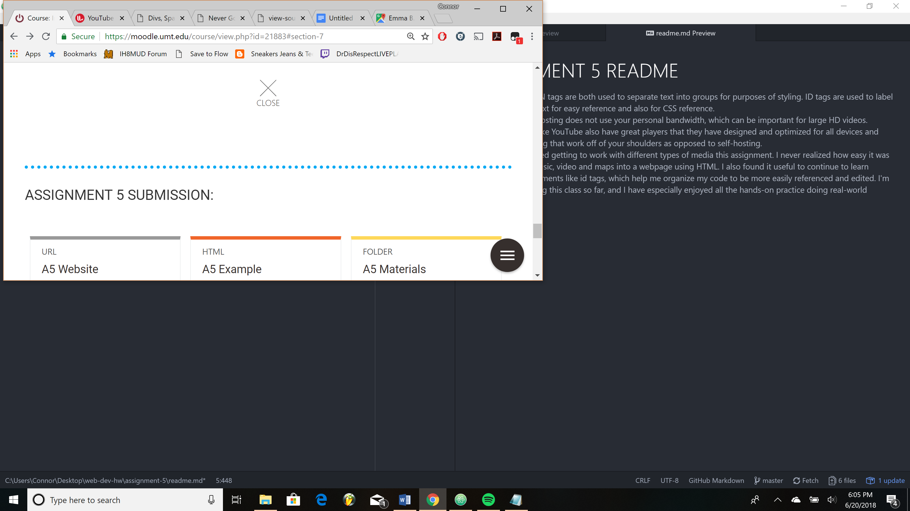

# ASSIGNMENT 5 README
- DIV and SPAN tags are both used to separate text into groups for purposes of styling.
ID tags are used to label sections of text for easy reference and also for CSS reference.
- Third party hosting does not use your personal bandwidth, which can be important for large HD videos. Companies like YouTube also have great players that they have designed and optimized for all devices and screens, taking that work off of your shoulders as opposed to self-hosting.
- I really enjoyed getting to work with different types of media this assignment. I never realized how easy it was to embed music, video and maps into a webpage using HTML. I also found it useful to continue to learn structural elements like id tags, which help me organize my code to be more easily referenced and edited. I'm really enjoying this class so far, and I have especially enjoyed all the hands-on practice doing real-world assignments.

]
