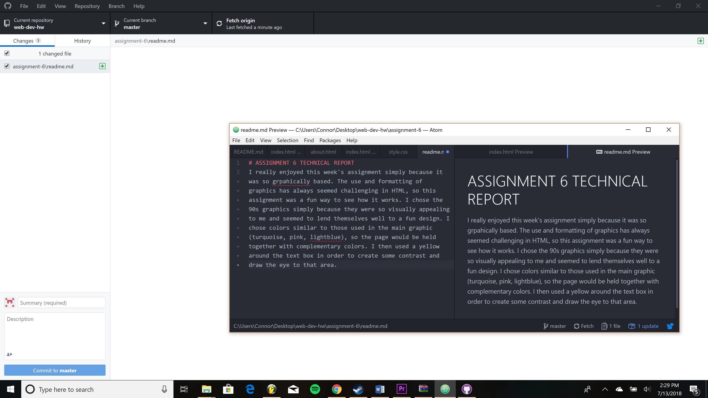

# ASSIGNMENT 6 TECHNICAL REPORT
I really enjoyed this week's assignment simply because it was so grpahically based. The use and formatting of graphics has always seemed challenging in HTML, so this assignment was a fun way to see how it works. I chose the 90s graphics simply because they were so visually appealing to me and seemed to lend themselves well to a fun design. I chose colors similar to those used in the main graphic (turquoise, pink, lightblue), so the page would be held together with complementary colors. I then used a yellow around the text box in order to create some contrast and draw the eye to that area.

