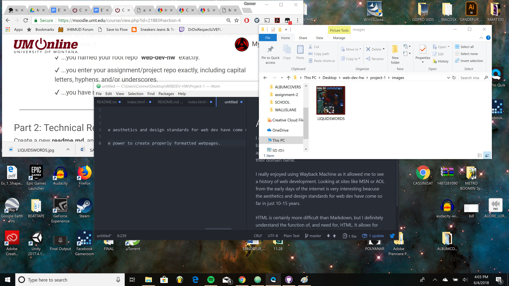

# ANOTHER READ ME
I use Mozilla Firefox or Google Chrome for any internet browsing, mobile or otherwise. A browser is a desktop application that allows the user to travel to web pages using their domain name.

I really enjoyed using Wayback Machine as it allowed me to see a history of web development. Looking at sites like MSN or AOL from the early days of the internet is very interesting beacuse the aesthetics and design standards for web dev have come so far in just 10-15 years.

HTML is certainly more difficult than Markdown, but I definitely understand the function of, and need for, HTML. It allows for formatting that translates to every system and gives web devs more power to create properly formatted webpages.

